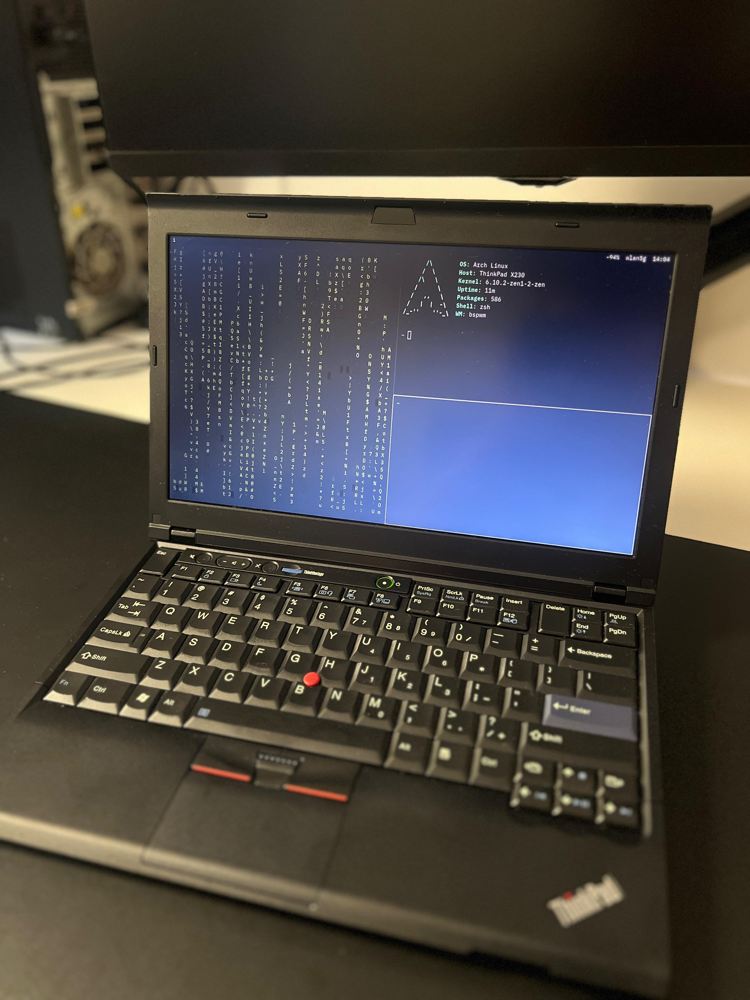
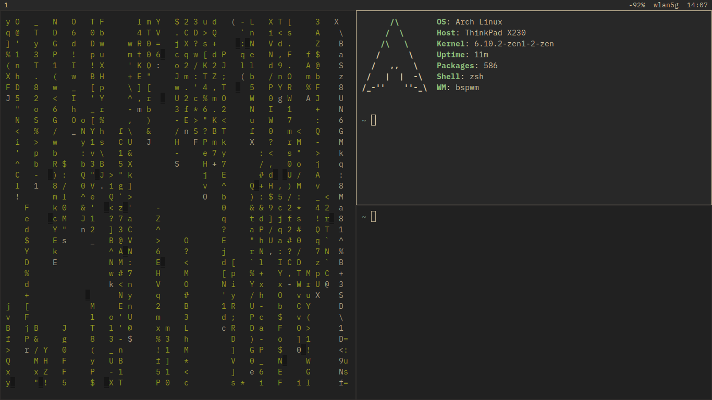
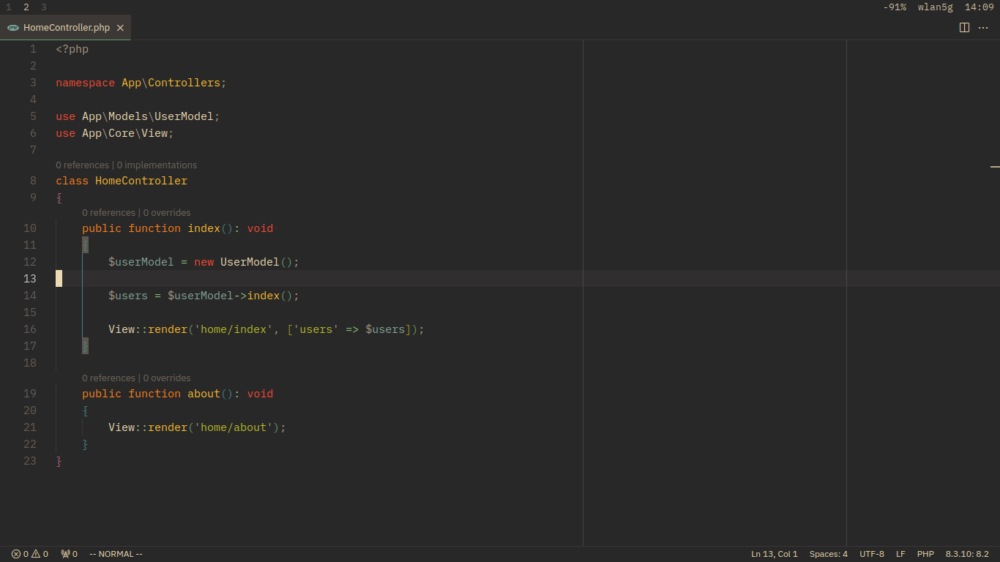
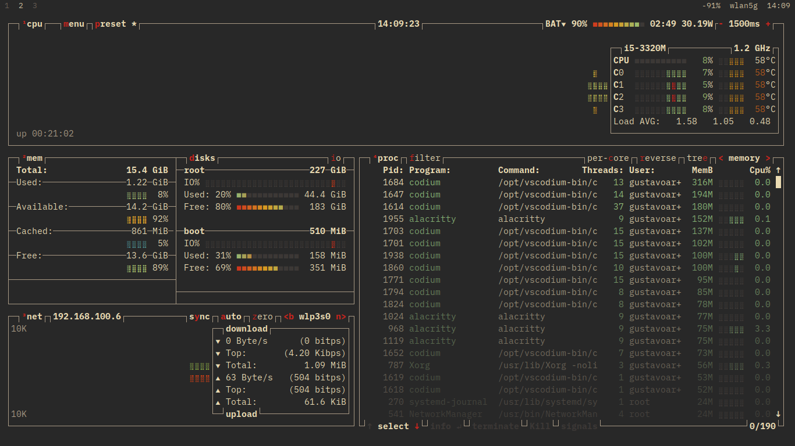

#  My Arch Linux Setup

These are the dotfiles of my configuration.

This repository aims to keep my settings files and apps that I use and share them.

My setup is focused on being simple and minimalist, it is completely keyboard-oriented (vim shortcuts) and based on the colorscheme [Gruvbox Dark](https://github.com/morhetz/gruvbox)

## My machine
### ThinkPad X230 Modded
 - BIOS: [1vyrain](https://1vyra.in/) 
 - Firmware: [EC Path](https://github.com/hamishcoleman/thinkpad-ec)
 - CPU: i5-3320M
 - Memory: 16Gb 1600mhz
 - Storage: SSD 256Gb
 - Battery: 8400 mAh
 - Keyboard: Classic X220 Keyboard
 - Palmrest: X220
 - Black hinge

## Software I use
- Operating System: [Arch Linux](https://archlinux.org/)
- Display Server: [X11](https://www.x.org/wiki/)
- Window Manager: [Bspwm](https://github.com/baskerville/bspwm)
- Status Bar: [Polybar](https://github.com/polybar/polybar)
- Terminal: [Alacritty](https://alacritty.org/)
- Shell: [Zsh](https://zsh.org)
- Launcher: [Rofi](https://github.com/davatorium/rofi)
- IDE: [VSCodium](https://vscodium.com/)
- Compositor: [Picom](https://github.com/ibhagwan/picom-ibhagwan-git)
- Browser: [Firefox (with BetterFox)](https://github.com/yokoffing/BetterFox)
- File Manager: [ranger](https://github.com/ranger/ranger) and [PCManFM](https://github.com/lxde/pcmanfm)
- Document Viewer: [Zathura](https://pwmt.org/projects/zathura/)
- Lockscreen: [i3lock](https://github.com/i3/i3lock)
- Text Editor: [Neovim](https://neovim.io/)
- Fonts: [IBM Plex](https://github.com/IBM/plex)

# Screenshots

## How-to
To run, you need to have the same packages that I have installed, and you must place all the files from the `.config` folder in your .config folder and place the `.zshenv` file in the root of your user's home page.

This configuration is adapted for my use and will work in my environment, if you want to use it you must adapt some things, good luck.

## Packages
`sudo pacman -S xf86-video-intel xorg-server xorg-xinit xorg-xauth xorg-xbacklight xorg-setxkbmap xorg-xrandr xorg-xrdb xorg-xsetroot btop neofetch openssh git less tlp calc docker docker-compose curl alsa-utils xdg-utils xdg-user-dirs bspwm sxhkd polybar alacritty rofi zsh ranger gvfs file-roller lxappearance mpv zathura zathura-pdf-mupdf scrot pcmanfm-gtk3 feh unclutter xautolock picom redshift i3lock ttf-ibm-plex powertop firefox`